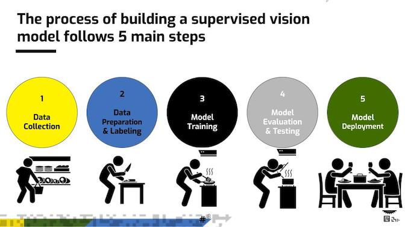
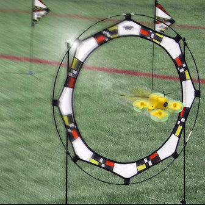

# LM_Session3_supervised_learning
Learning Machines Workshop -- Session 3: Supervised Learning Activity -- Camera

# Your goal is to build an AI model to automatically drive the drone through a gate
# Follow the Supervised Learning steps to do so:

#This version is using your camera instead of the drone's

# Installation  
- Clone the repo `git clone https://github.com/mitmedialab/LM_Session3_supervised_learning.git`
- Change the directory to `cd LM_Session3_supervised_learning`
- Start python virtual environment `virtualenv --python=python3 python`
- Run activation script (re-run whenever entering a new terminal) `source activate`
- Install python  dependencies `pip install -r requirements.txt`

# How to get everything running
- Start LearningMachines (in new terminal) `source activate && jupyter lab`
